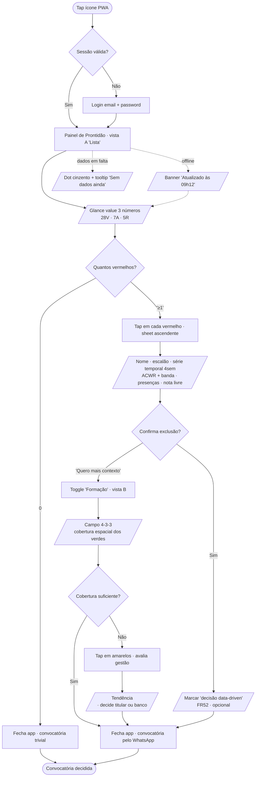
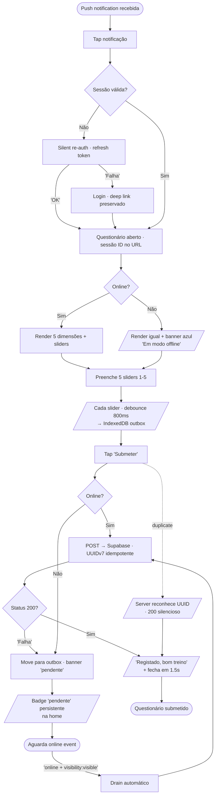
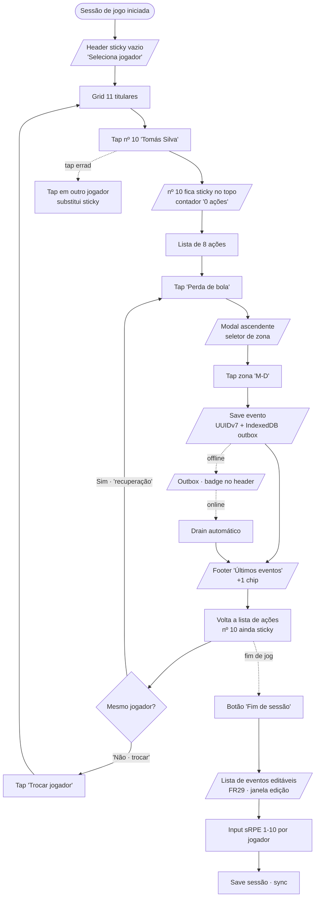
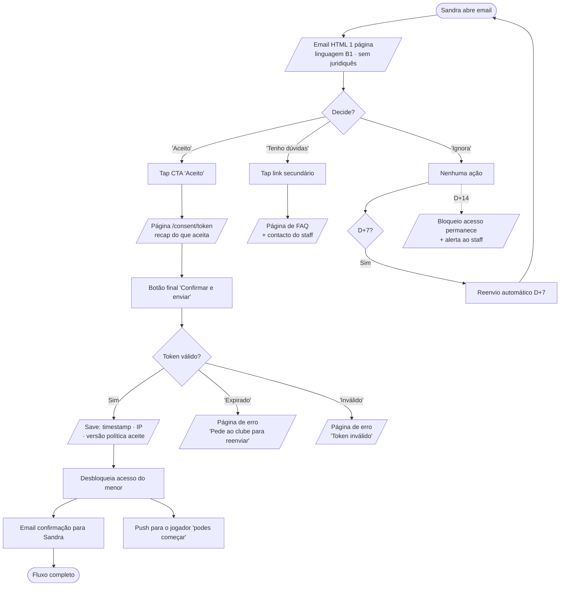
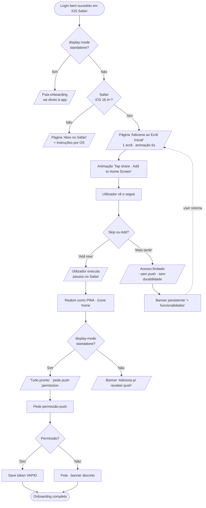

# UX Design Specification — SPARTA

**Author:** Antero
**Date:** 2026-05-06

## Executive Summary

### Project Vision

PWA mobile-first que substitui a memória, o WhatsApp e o Excel do staff técnico amador de futebol 11 por uma vista única de prontidão semafórica de 40 jogadores. Mais do que uma ferramenta de dados, o SPARTA é uma decisão de produto: a tecnologia alimenta a conversa humana entre treinador e atleta — não a substitui. A UX existe para tornar essa conversa mais informada, não para automatizar feedback.

### Target Users

Quatro personas com fronteiras de UX deliberadas:

- **José, Treinador (48)** — utilizador do Painel de Prontidão. Telemóvel ao café da manhã. Toma decisão de convocatória em <30s. Não é técnico, mas é exigente: o que faz, faz com método.
- **Ana, Analista/Preparadora Física (34)** — central de comando operacional. Tablet 10" em bancada durante jogo (touchscreen 3-ecrãs); portátil em casa para análise diferida. Única no staff que sabe o que é ACWR. UX para Ana é tão crítica como UX para José.
- **Tomás, Jogador (16)** — utilizador do questionário, ≤2 minutos, ≥80% de adesão alvo. Telemóvel, frequentemente offline no campo. Adolescente com adesão oscilante.
- **Sandra, Encarregada de Educação (42)** — não é utilizadora da app. Gateway de consentimento por email tokenizado. Decisão única, fluxo dedicado fora da PWA.

Três papéis ativos na PWA (Treinador, Analista, Jogador) + um ator externo (EE) com fluxo próprio. Faixa etária dos jogadores: 13–18+, com versão linguisticamente adaptada para sub-14.

### Key Design Challenges

1. **Confiança no semáforo durante o "wow moment"** — o painel tem de ser legível e convincente o suficiente para que o treinador acredite nos dados quando contradizem a sua intuição. É design de confiança, não apenas de informação.
2. **Touchscreen 3-ecrãs zero-fricção em jogo** — UI usada em tablet com olhos no campo, ~187 eventos em 90 minutos. Cada tap conta; cada erro é caro.
3. **Filosofia "dados mediados" comunicada sem paternalismo** — explicar ao jogador que não vê o seu painel sem que pareça opaco ou injusto.
4. **Onboarding iOS Add-to-Home-Screen** — gating de funcionalidades críticas (push, durabilidade). Risco real de abandono se mal desenhado.
5. **Modo offline visível mas tranquilizador** — badge de pendentes presente (segurança) sem gerar ansiedade.
6. **Dual language register** — sub-14 (simples, sem juridiquês) e sénior partilham a mesma app. Política de privacidade, questionário e prompts têm versões adaptadas.
7. **Densidade num ecrã de 360px** — 40 jogadores num Painel de Prontidão sem perder o "glance moment".

### Design Opportunities

1. **Semáforo emocional, não tabular** — concorrentes pagos privilegiam tabelas densas. O SPARTA pode ser o produto onde o treinador *sente* o estado do plantel num glance.
2. **UI invisível em jogo** — touchscreen 3-ecrãs como caso de "o melhor UI desaparece no fluxo de uso". Tap-tap-tap sem desviar olhos do campo por mais de 1 segundo.
3. **Consentimento parental empático** — Sandra não é jurista nem técnica. A página de consentimento pode ser o melhor "1-screen privacy explainer" que alguma vez viu — diferenciador real face ao "li e aceito" da concorrência.
4. **Offline como feature** — comunicar "offline está bem" reduz ansiedade e legitima uso em campos sem cobertura.
5. **Marcação de "decisão data-driven" (FR52)** — micro-UX que torna o KPI auditável e simultaneamente reforça o ritual do produto: cada decisão informada é registada com uma frase do staff.
6. **Onboarding iOS animado** — momento de potencial dropout transformado em demonstração curta e clara do "porquê instalar".

## Core User Experience

### Defining Experience

O SPARTA não tem uma core action única — tem três loops, um por papel ativo, cada um com tolerância de fricção própria:

- **Treinador:** abrir o Painel de Prontidão e decidir convocatória em <30s
- **Analista (em jogo):** registar ~187 eventos no touchscreen 3-ecrãs em 90 minutos, sem desviar olhos do campo
- **Jogador:** submeter questionário pré/pós-sessão em <2 minutos, frequentemente offline

Tudo o resto (perfis, dashboards, exportações, notas) é serviço a estes três loops. Se estes funcionam, o produto é viável; se algum falha, o produto morreu nesse papel.

O encarregado de educação tem um quarto loop secundário e único: responder ao consentimento parental por email, sem entrar na app.

### Platform Strategy

- **PWA mobile-first** (Next.js 16 + Serwist) com Add-to-Home-Screen opcional
- **Touch-first** em todos os fluxos primários; desktop é cobertura defensiva
- **Offline obrigatório** para questionário e registo de eventos
- **Sem instalação em stores** — distribuição via link
- **Web Push (VAPID)** para notificações; iOS exige A2HS para push e durabilidade
- **Browsers:** Chrome/Safari/Firefox/Edge/Samsung Internet últimas 2 versões; Safari iOS 16.4+; bloqueio explícito de WebView in-app (FB, IG, WhatsApp)
- **Breakpoints alvo:** 360 / 414 / 768–1024 / ≥1025 px

### Effortless Interactions

Sete momentos onde fricção = morte:

1. Abrir questionário a partir de push notification — <1s mesmo offline
2. Submeter questionário offline sem ecrã de erro — banner "1 pendente" discreto
3. Tap no jogador no touchscreen 3-ecrãs — target ≥60px, zero animação
4. Transição entre ecrãs no fluxo 3-ecrãs — ≤50ms ou nada
5. Pintura do Painel de Prontidão para 40 jogadores — <2s, glance imediato
6. Drill-down num jogador — série temporal de 4 semanas em ≤500ms
7. Resposta de consentimento parental — 1 página, 2 botões, sem registo de conta

Operações automáticas (sem intervenção do utilizador): ACWR, sRPE, status semáforo, push notifications agendadas, auto-derivação de minutos jogados, drain automático da outbox, reminders D+7 / D+14, heartbeat anti-pause.

### Critical Success Moments

Cinco momentos make-or-break:

1. **Primeiro Add-to-Home-Screen em iOS** (Tomás, dia 0) — gating de funcionalidades
2. **Primeiro questionário offline com sucesso** (Tomás, semana 1) — confiança no offline
3. **Primeira convocatória decidida com o painel** (José, semana 2) — adoção do ritual
4. **Primeiro evento gravado durante jogo real** (Ana, semana 3) — UI tem de ser reflexiva
5. **Primeiro consentimento parental respondido em <60s** (Sandra, dia 0) — fluxo autoexplicativo

### Experience Principles

Cinco princípios opinionated:

1. **Glance > Read** — o staff decide a olhar, não a interpretar. Cor + forma + posição antes de tabelas. Hierarquia visual antes de hierarquia textual.
2. **Reflex > Read** durante jogo — o touchscreen 3-ecrãs é extensão do polegar. Latência, animações e modais são dívida.
3. **Confiança por explicabilidade** — todo o sinal sintético (semáforo, ACWR, alerta) é drillable até ao dado bruto.
4. **Offline é normal, não excecional** — UX do offline igual à UX do online; o estado pendente é informação, não erro.
5. **Linguagem dual sem fragmentação** — sub-14 e sénior partilham o design system; copy e tom adaptam-se sem "modo infantil".

## Desired Emotional Response

### Primary Emotional Goals

Quatro sentimentos-alvo distintos, um por papel. Não há um sentimento único que sirva os quatro contextos — esta é uma decisão UX deliberada.

- **José (Treinador) — Confiança calma:** "Sei o que estou a olhar e o que vou decidir, sem dúvidas, sem ansiedade."
- **Ana (Analista) — Domínio reflexo:** "A app desapareceu — sou eu, o jogo, e os dados que fluem do meu polegar."
- **Tomás (Jogador) — Respeito leve:** "Foi rápido, foi para alguém que se importa, voltou a ser o meu sábado."
- **Sandra (EE) — Tranquilidade informada:** "Percebi o que estão a fazer com os dados do meu filho — e percebi pela primeira vez."

**Diferenciação emocional:** o SPARTA rejeita o rigor frio dos dashboards profissionais (Catapult, Metrifit) e a leveza desorganizada do status quo (WhatsApp + Excel). A aposta é "confiança humana mediada por dados" — o treinador sente-se mais ele próprio, não menos.

### Emotional Journey Mapping

A jornada emocional dos 4 papéis ao longo dos 5 momentos críticos definidos no Step 3:

- **Descoberta (D0):** ceticismo cauteloso → curiosidade
- **Onboarding (D0–D3):** alívio (UI percebe o trabalho real); respeito (consentimento explicado pela primeira vez)
- **Core action (sem 1–2):** confiança calma (José) | domínio reflexo (Ana) | hábito leve (Tomás)
- **Wow moment:** **vindicação**, não surpresa — os dados pensam *com* o José, não *por* ele
- **Falha (offline, erro):** tranquilidade ("continua a funcionar — está tudo bem")
- **Retorno:** ritual (sábado de manhã, café, painel)

**Insight crítico:** o "wow moment" do José é **vindicação**, nunca correção. UX tem de proteger este sentimento — a app sugere, nunca prescreve, nunca o faz sentir-se corrigido pela máquina.

### Expanded Wellness & Analytics Features - UX Considerations

A expansão do MVP inclui novos campos de bem-estar (dores musculares, humor, contexto de exames) e métricas táticas expandidas (cantos, cartões, golos, clean sheet, entradas na área). Cada adição mantém os princípios emocionais acima mas requer ajustes de UX:

**Para o Jogador (Questionário Expandido):**

- **Dores musculares (seleção de zona):** usar body diagram clicável (estilo Fitbod/Strava) — visual, sub-14 comprehensível, sem linguagem médica. Máximo 2 segundos para seleção.
- **Humor/estado emocional:** escala de emojis (😢 😐 😊 😄 😃) em vez de números — menos intimidante, cognitivamente mais acessível. Copy em primeira pessoa: "Como te sentiste antes do treino?"
- **Contexto de exames:** toggle simples "Tem testes/exames esta semana?" — framing neutro, sem urgência. Aparece como campo semanal, não por sessão, para reduzir friç

ção (uma pergunta de quinta para toda a semana).
- **KPI de preenchimento:** expandir target de ≤2 min para ≤2.5 min para acomodar 3 novos campos (dores, humor, exames), assumindo que cada campo soma ~20s de interação.

**Para a Ana (Touchscreen 3-ecrãs em Jogo - Expansão de Ações):**

- **Novos tipos de ação (cantos, cartões, golos):** adicionar 3 novos botões à "Ecrã com as Ações". Cantos e cartões são eventos raros (2–8 por jogo); golos ainda mais raro. Não impactam fluxo crítico mas requerem segundo ecrã com contexto (tipo de jogada para golo, tipo de infração para cartão, lado para canto).
- **UX de "jogador" para eventos sem jogador específico (ex: canto):** usar botão "Equipa" ou "Evento Coletivo" na seleção de jogador, permitindo saltar direto para zona/contexto.
- **Paleita de ações:** manter visual chunking — separar ações por tipo: ações individuais (perdas, recuperações, remates...) | ações coletivas (cantos, entradas área) | eventos (cartões, golos).
- **Relógios de "tempo útil":** UI separada em ecrã de jogo (pós-jogo em vez de durante), com dois contadores lado-a-lado (total vs. bola em jogo). Relevante para análise, não para Ana em jogo.

**Para José (Painel Expandido e Drill-down):**

- **Novos dashboards (estatísticas, análise tática, disciplina):** acessados via abas secundárias depois de "Prontidão" no bottom nav. Não impactam core action (convocatória em <30s) mas expandem profundidade de análise.
- **Heatmap de perdas/recuperações por zona:** visual exploratório (não crítico para decisão, mas "nice to have" para padrões). Usar cor quente (vermelho=perdas, azul=recuperações) com transparência para não sobrepor dados.
- **Drill-down a partir de clean sheet / cartões:** gráfico de timeline do jogo (horizontal, eventos marcados). Clicável para ver contexto de cada golo/cartão.

**Para Relatórios e Dashboards (Growth):**

- **Agregações por jogador (% convocatórias, % minutos):** mostrar como cards com mini gráficos (sparkline) — não tabelas densas. "João: 85% convocado, 62% minutos" em forma de card, comparativa época anterior.
- **Dashboard de bem-estar por semana:** gráfico de linha (semanas no eixo X, humor/sono/dores no Y) com dots clicáveis para detalhe. Possibilita identificação de padrões (ex: "humor cai sempre pós-jogo"; "sono péssimo = fadiga no treino seguinte").

**Restrição crítica:** tempo de carregamento do Painel continua ≤2s mesmo com estas novas agregações. Arquitetura de materialização (cálculo offline) pode ser necessária.

### Micro-Emotions

Sete pares emocionais críticos com mitigação UX direta:

- **Confiança ↔ Cepticismo:** drill-down explicativo, transparência da fórmula, banda de incerteza visível
- **Domínio ↔ Frustração** (Ana): zero animações em jogo, feedback háptico, targets ≥60px, persistência de seleção
- **Respeito ↔ Vigilância** (Tomás): linguagem em primeira pessoa, explicação clara de quem vê, ausência de leaderboards
- **Tranquilidade ↔ Ansiedade** (offline): badge "pendente" suave, confirmação calma após sync
- **Confiança ↔ Paternalismo:** comunicação explícita do porquê da mediação; staff treinado para fechar o ciclo em <48h
- **Vindicação ↔ Humilhação** (José): a app apresenta dados, nunca dá ordens; verbos neutros ("estado", "tendência")
- **Tranquilidade ↔ Burocracia** (Sandra): 1 página, 2 botões, sem juridiquês; tom adulto-empático

### Design Implications

Cada emoção mapeia em escolhas concretas de UI/UX:

- **Confiança calma (José)** → tipografia generosa, espaço em branco, semáforo grande mas silencioso, agregados visíveis em 1s
- **Domínio reflexo (Ana)** → zero chrome em jogo, full-bleed, alvos enormes, háptico nativo, persistência do jogador entre eventos
- **Respeito leve (Tomás)** → copy em primeira pessoa, ícones suaves (não médicos), ausência de score/ranking, confirmação curta
- **Tranquilidade informada (Sandra)** → 1 página HTML de email, sem registo; tom adulto-empático; visual calmo sem urgência
- **Vindicação não-humilhação** → painel sugere, nunca prescreve; verbos neutros, nunca imperativos
- **Sem celebração algorítmica** → sem toasts "parabéns", sem gamification, sem streaks

### Emotional Design Principles

Quatro princípios com prioridade clara, ordenados por importância:

1. **Calma > Excitação** — sem copy que celebre, alarme ou exija urgência. O SPARTA é uso semanal calmo, não engagement diário viciante.
2. **Voz humana, não institucional** — PT-PT natural, registo conversacional, sem juridiquês mesmo em fluxos GDPR. Tom de "treinador a falar com pais".
3. **Sugerir, não prescrever** — sinais, nunca ordens. Verbos neutros ("estado", "tendência"), nunca imperativos. Protege autoridade do treinador e autonomia do atleta.
4. **Confiança ganha-se pela explicabilidade, não pela autoridade** — todo o sinal sintético é drillable. A app nunca pede fé.

### Emotions to Avoid Deliberately

Lista negra explícita de sentimentos que a UX deve prevenir:

- **Ansiedade** — sem badges vermelhos sem motivo, sem urgência fabricada
- **Vigilância** — sem linguagem de "monitorização", "controlo", "rastreio" virada ao jogador
- **Humilhação algorítmica** — a app nunca contradiz o treinador em frente do jogador
- **Burocracia GDPR** — Sandra decide, não assina contratos
- **Gamification falsa** — sem streaks, leaderboards, badges, contadores
- **Paternalismo opaco** — Tomás sabe sempre que dados dá e a quem; mediação transparente

## UX Pattern Analysis & Inspiration

### Inspiring Products Analysis

Seis referências agrupadas por papel servido. Não é benchmark exaustivo — é seleção deliberada do que cada papel já encontra noutras apps que usa.

**Para o Treinador (Painel de Prontidão):**

- **Apple Health (Today)** — hierarquia 3 níveis, cor parcimoniosa, "glance value" no topo
- **Linear (Inbox)** — agrupamento por estado, redundância cor+ícone, ações rápidas
- **Citymapper ("go now")** — decisão sob pressão temporal, cards prioritárias

**Para o Analista (touchscreen 3-ecrãs em jogo):**

- **Hudl Sportscode / Wyscout** — sticky player selection, palette de ações, atalhos
- **Square POS / Stripe Terminal** — full-bleed, zero chrome, háptico, transições instantâneas

**Para o Jogador (questionário):**

- **Daylio** — questionário visual <30s, autosave progressivo, sem submit explícito
- **Strava ("como te sentiste?")** — copy em primeira pessoa, tom respeitoso

**Para a Encarregada de Educação (email de consentimento):**

- **Stripe/Mailgun emails transacionais** — 1 página HTML, 1 CTA grande, plain-text fallback
- **GOV.UK** — linguagem clara B1, estrutura "o quê → porquê → o que fazes", sem juridiquês

**Filosofia geral:**

- **Linear** — "fast tools for fast people"; cor parcimoniosa; animações ≤100ms
- **Things 3** — "calm productivity"; ausência de gamification e notificações invasivas

### Transferable UX Patterns

**Navegação e hierarquia:**

- Bottom tab nav com ≤4 tabs por papel (não menu hambúrguer)
- "Today" / "Hoje" como ecrã default em todos os papéis
- Drill-down em 3 níveis máximo (sumário → grupo → indivíduo)
- ⌘K / search global para staff (Ana avançada)

**Interação e gesto:**

- Sticky selection no fluxo 3-ecrãs (jogador persiste até deselect explícito)
- Long-press para ações secundárias (sem "..." escondidos)
- Swipe para arquivar/editar pós-jogo
- Autosave progressivo no questionário (sem submit obrigatório por resposta)
- Feedback háptico nativo em cada evento de jogo

**Visual e tipografia:**

- Cor + forma + posição (redundância sensorial) no semáforo
- Tipografia generosa em screens de decisão; números grandes, espaço em branco
- Zero animação em screens reflexos (Ana em jogo)
- Cor parcimoniosa: branco/neutro como base, cor só para sinal

**Copy e tom:**

- Primeira pessoa nos formulários ("como te sentes?")
- Estrutura "o quê → porquê → o que fazes" no consentimento e nas explicações
- Sem juridiquês em fluxos GDPR
- Confirmação calma ("registado, bom treino"), não celebratória

**Estado offline:**

- Banner "X pendentes" persistente mas discreto, cor neutra
- "Sincronizando..." → confirmação clara, sem drama

### Anti-Patterns to Avoid

Oito padrões comuns no espaço athlete-tracking e SaaS rejeitados:

1. **Tabelas densas tipo Excel** (Catapult, Metrifit) — viola "Glance > Read"
2. **Gráficos no topo do dashboard principal** (Whoop, Apple Fitness) — viola "<30s"
3. **Gamification, streaks, achievements** (Strava, Duolingo) — viola "Respeito leve"
4. **Modais "Tem certeza?" antes de cada ação** — viola "Reflex > Read"
5. **Notificações "Sentimos sua falta"** — viola "Calma > Excitação"
6. **Onboarding de 5 ecrãs "Bem-vindo!"** — desperdício de tempo do utilizador
7. **Personalização cosmética** (temas, ícones, dark mode toggle) — viola "ferramenta séria"
8. **Jargão científico exposto sem explicação** (ACWR sem fórmula visível) — viola B1 e explicabilidade

### Design Inspiration Strategy

**Adotar diretamente:**

- Apple Health — hierarquia 3 níveis no Painel de Prontidão
- GOV.UK — estrutura de copy do consentimento parental
- Daylio — autosave + escala visual no questionário
- Linear — search/⌘K global para staff
- Things 3 — paleta parcimoniosa, tipografia generosa
- Square POS — zero chrome em fluxo reflexo da Ana em jogo

**Adaptar (modificar):**

- Hudl Sportscode → simplificado a 3 ecrãs sem configuração
- Strava "como te sentiste?" → sem social, badges ou comparação
- Citymapper "go now" → cards de decisão para 11+ jogadores

**Evitar deliberadamente:**

- Gamification fitness (Strava rings, Apple Fitness, Whoop)
- Dashboards analíticos densos (Catapult, BI tools)
- Onboarding longo "feel good" (Headspace, Calm)
- Notificações de re-engagement
- Personalização cosmética

## Design System Foundation

### Design System Choice

**shadcn/ui + Radix UI sobre Tailwind CSS** — abordagem themeable/headless com componentes copy-paste no repositório. Não é package npm; é código que vive no projeto.

**Stack confirmado:**

- **Tailwind CSS** como engine de estilos (já fixado pelo PRD)
- **Radix UI primitives** para acessibilidade (focus, ARIA, keyboard, screen readers)
- **shadcn/ui** como biblioteca de componentes copy-paste estilizados em Tailwind
- **lucide-react** como biblioteca de ícones (alinhada com shadcn/ui defaults)
- **recharts** para visualizações analíticas (Phase 1: trend + carga acumulada; Phase 2: curva de recuperação)

### Rationale for Selection

Seis razões alinhadas com restrições do PRD e princípios de UX:

1. **Stack já fixado** — Next.js 16 + Tailwind decididos no PRD; shadcn/ui é solução nativa deste stack
2. **WCAG 2.1 AA praticamente de graça** — Radix UI é gold-standard a11y; cumpre NFR36–NFR44 sem trabalho adicional
3. **Sem lock-in, sem peso** — código no repositório, bundle ≤200KB gzipped (NFR11) viável
4. **Customização total** — Painel de Prontidão, touchscreen 3-ecrãs e questionário visual exigem componentes custom; Material Design seria mais difícil de adaptar a este nível
5. **Provider-agnostic** (NFR58) — sem dependência de SaaS de design; código sobrevive ao hipotético desaparecimento de shadcn/ui
6. **Ecosistema dominante em 2026** para Next.js + Tailwind

### Implementation Approach

**Componentes adotados as-is do shadcn/ui:**

Button, Card, Input, Form, Label, Select, Checkbox, Radio Group, Switch, Dialog, Sheet, Popover, Tooltip, Toast (Sonner), Alert, Badge, Tabs, Accordion, Calendar, Date Picker, Table (vistas explícitas), Skeleton.

**Componentes custom (sem analógico em shadcn/ui):**

- **Painel de Prontidão** — semáforo agrupado por posição em campo
- **Questionário Visual de Fadiga** — 5 dimensões, escala visual, autosave progressivo
- **Touchscreen 3-ecrãs** — fluxo player → action → zone com sticky selection
- **Curva de Recuperação Individual** (Growth) — chart com recharts, customizado
- **Field Visualization** — SVG das zonas do campo para o ecrã 3 do touchscreen

**Componentes deliberadamente evitados:**

- Carousel (sem caso de uso)
- Command palette em mobile (apenas desktop, Ana avançada)
- Navigation Menu complexo (bottom tab nav é o padrão)

### Design Tokens

**Cor (filosofia: parcimoniosa, cor é informação não decoração):**

- Base: branco / `#0A0A0A` (light/dark)
- Surface: `#F5F5F5` / `#161616`
- Texto: 3 níveis (primary / secondary / muted)
- Semáforo: Verde `#16A34A`/`#22C55E`, Amarelo `#CA8A04`/`#EAB308`, Vermelho `#DC2626`/`#EF4444`
- Signal info: `#2563EB`/`#3B82F6` (estados pendente/sync)
- **Cor do semáforo nunca usada sozinha** — sempre acompanhada de ícone/forma (redundância sensorial)
- **Dark mode via `prefers-color-scheme` apenas** — sem toggle de utilizador (viola princípio "ferramenta séria")

**Tipografia:**

- Font: Inter (fallback system-ui)
- System-ui em rotas críticas (questionário, touchscreen) — zero FOUT/CLS
- Escala: 12 / 14 / 16 / 18 / 20 / 24 / 30 / 48 px com line-heights generosos
- Pesos: 400 / 500 / 600 (sem 700+ — estética calma)

**Espaçamento:** Tailwind 4-base scale defaults, sem desvios.

**Touch targets:** ≥44px (WCAG); ≥60px no touchscreen 3-ecrãs em jogo.

**Border-radius:** 2 / 6 / 12 / full px.

**Sombras:** mínimas — sm e md apenas; sem lg+.

**Animação:** 150ms ease-out default; 0ms no fluxo Ana em jogo; respeitar `prefers-reduced-motion`.

### Customization Strategy

**Phase 1 (MVP):**

- Tokens estabilizados em `tailwind.config.ts`
- 5 componentes custom escritos
- Componentes shadcn/ui adotados as-is (sem fork)
- axe-core no CI a enforce WCAG AA (NFR37)
- **Sem Storybook** — overhead injustificado para solo dev em 4 semanas

**Phase 2 (Growth):**

- Tema escuro completo (extensão para além de OS-driven)
- Componente "Curva de Recuperação Individual"
- Componente "Perfil Unificado do Jogador"

**Phase 3 (Vision):**

- Formalização como design system público se houver multi-clube com identidades visuais diferentes
- Reavaliar Storybook se equipa crescer >1 dev

**Princípio invariante:** tokens são contrato. Componentes custom evoluem; tokens só mudam com versionamento explícito.

## Defining Core Experience

### The Defining Interaction

**"Olhar para o plantel. Confiar no verde. Questionar o vermelho."**
*("Glance at the squad. Trust the green. Question the red.")*

Esta é a interação que define o SPARTA. Tudo o resto — questionários, registo de stats, dashboards, exportações — existe para alimentar este momento.

**O painel é o produto.** O questionário do Tomás é manutenção, o touchscreen da Ana é infraestrutura, o consentimento da Sandra é compliance. A defining experience é o sábado de manhã do José, café na mão, 30 segundos para decidir uma convocatória de 18.

**Como o José descreve aos amigos:**

> "Sábado de manhã abro o telemóvel, vejo logo quem está pronto e quem não está. Decido a convocatória em 2 minutos. Antes era papel, WhatsApp e memória — nunca tinha a certeza."

### User Mental Model

**Antes do produto** (modelo discreto e implícito):

- Memória + WhatsApp + Excel da Ana, costurados na cabeça
- Decisão por intuição, com sinais ignorados
- Confiança aparente, dispersão cognitiva real

**Com o produto** (modelo agregado e visível):

- 40 dots no painel, agrupados por posição
- Glance + drill-down em 30s
- Decisão por evidência: "vai dar **porque**..."

**Mudança fundamental:** transferência de carga cognitiva. O José deixa de *guardar* informação na cabeça e passa a *consultar* informação no telefone. Cérebro liberta-se para a parte criativa do trabalho.

**Concorrência mental real:** não é Catapult, Spond ou TeamStats — é a memória do José e o status quo cognitivo. O verdadeiro adversário é o "vou de instinto", não o software.

**Riscos de modelo mental:**

- Cor sem explicação → mitigação: drill-down obrigatório, nunca opaco
- Sobre-confiança no semáforo (falso verde) → mitigação: banda de incerteza visível, painel sugere nunca prescreve
- Vermelho como ordem → mitigação: verbos neutros, o painel apresenta dados, o José decide

### Success Criteria

Cinco indicadores concretos:

1. **Glance < 3s** — abrir → ver agregado → entender estado geral
2. **Decisão em < 30s** — abrir → drill-down → fechar com convocatória decidida
3. **"Vou ao painel" como ritual** — ≥90% das sessões iniciam-se com staff a consultar painel
4. **Confiança calibrada** — vindicação, nunca humilhação algorítmica
5. **"Wow moment" mensal** — ≥1 decisão data-driven documentada por mês na fase competitiva

**Sinais de falha da defining experience:**

- José deixa de abrir após semana 4 → UI confusa ou sem valor
- José abre mas continua a decidir por instinto → painel não convincente
- Falso verde + lesão → confiança erodida
- Falso vermelho + jogador rebenta → confiança erodida

### Novel UX Patterns

**Familiar (sem educação):**

- Semáforo verde/amarelo/vermelho (com redundância sensorial cor+forma+posição)
- Lista vertical scroll, tap para drill-down, cards agrupados

**Familiar mas adaptado:**

- Agrupamento por posição em campo (não alfabético, segue mental model do treinador)
- Sticky selection no fluxo da Ana (de Hudl Sportscode, novo no segmento amador)

**Novo (precisa de comunicação clara):**

- "Estado de prontidão" como conceito UX — não existe em Spond/TeamStats/Strava
- Filosofia "dados mediados" — jogador não vê painel próprio (decisão de produto)
- ACWR exposto a leigos — tooltip pedagógico obrigatório

**Estratégia de educação:**

- Onboarding minimalista (1 ecrã para José: "verde = pronto, amarelo = atenção, vermelho = não recomendado")
- Tooltips contextuais em ACWR e fadiga (tap-to-explain)
- Help-text inline na primeira semana, ocultável após domínio

### Experience Mechanics

**Iniciação (sábado, 10h30):**

- Trigger: instinto/hábito (não push notification)
- Entry: PWA no home screen, single tap
- Estado: rota default = Painel de Prontidão; sessão persistente, zero login
- Cold start <2s; pintura completa para 40 jogadores em ≤2s (NFR1)

**Interação:**

1. **Glance phase (0–3s):** header com agregados (11 verdes / 5 amarelos / 5 vermelhos, typography 48px); abaixo, agrupamento por posição (GR | DEF | MED | AVA) com semáforo inline
2. **Investigation phase (3–25s):** tap em cada amarelo/vermelho → sheet ascendente com nome, escalão, série temporal 4sem, ACWR + banda, presenças, nota livre
3. **Decision phase (25–30s):** José fecha app, decide convocatória no WhatsApp (fora de scope MVP)
4. **Pós-decisão (opcional):** marcar "decisão data-driven" via UI discreta (FR52) — frase livre, save

**Feedback:**

- Tap em jogador → drill-down ≤500ms
- Sheet abre com swipe-up, fecha com swipe-down, animação 200ms ease-out
- Sem toast "carregado" — silêncio é confirmação

**Tratamento de erros:**

- Offline: última versão com timestamp suave ("Atualizado há 12 min"), sem alarme
- Dados em falta: semáforo cinzento neutro + tooltip "Sem dados ainda"
- ACWR insuficiente (<4 sem): banda cinzenta + tooltip "Em construção"
- Falha de load: skeleton + mensagem clara, sem dramatização

**Conclusão:**

- Sem ecrã de "completed" — fechar é a conclusão
- Próximo natural: WhatsApp para convocatória
- Retorno: sábado seguinte, mesmo ritual. **Defining experience é cíclica, não one-shot.**

**Detalhe crítico — o "não jogas hoje":**

Quando José decide deixar Tomás de fora, a conversa difícil acontece **fora da app**. A app **prepara o José para a conversa** ao fornecer dados que sustentam a decisão.

O drill-down do Tomás é briefing pré-conversa, não a conversa em si. Implicação UX: o drill-down dá **argumentos**, não veredicto. "Sono médio 4h, ACWR 1.8, 3 jogos em 7 dias" lê-se como evidência. "Tomás vermelho" lê-se como sentença. **Diferença de tom é diferença de produto.**

## Visual Design Foundation

### Personality

A personalidade visual em uma frase: **"Calma clínica de quem trabalha com pessoas."**

Visual mais próximo de Things 3 e GOV.UK do que de Strava ou Catapult. Branco como protagonista (~75% de qualquer ecrã); cor reservada a sinal; tipografia generosa; cantos suaves; sombras mínimas; zero ilustrações decorativas.

**Excluído deliberadamente:**

- Visual desportivo "macho" (fontes condensadas, vermelhos agressivos)
- Visual fitness "lifestyle" (cores néon, fotos suadas)
- Visual SaaS startup genérico (gradientes pastel, ilustrações isométricas)
- Visual médico clínico frio

### Color System

**Filosofia:** branco é a cor mais usada do produto. Cor é informação, nunca decoração. Sem cor de marca distintiva no MVP — a marca é tipografia e clareza.

**Paleta semântica completa** (light + dark via `prefers-color-scheme`):

- **Backgrounds:** `bg/base`, `bg/surface`, `bg/surface-2`, `bg/muted`
- **Text:** `text/primary`, `text/secondary`, `text/muted`, `text/disabled`
- **Borders:** `border/default`, `border/strong`, `border/subtle`
- **Accent:** `accent/primary` (`#18181B` light / `#FAFAFA` dark — quase preto/branco intencional), `accent/focus-ring` (`#2563EB` / `#3B82F6` — azul independente do accent)
- **Semáforo:** verde (`#16A34A`/`#22C55E`), amarelo (`#CA8A04`/`#EAB308`), vermelho (`#DC2626`/`#EF4444`), neutro cinza
- **Info/Sync:** azul (`#2563EB`/`#3B82F6`)

Cada cor de sinal tem trio: `cor`, `cor-bg` (50/950), `cor-border` (200/800).

**Acessibilidade WCAG 2.1 AA verificada:**

- `text/primary` em `bg/base`: 19.97:1 (AAA)
- `text/muted` em `bg/base`: 4.83:1 (AA)
- `signal/ready` em `bg/base`: 4.13:1 (AA grande/UI; **redundância sensorial obrigatória** — cor + ícone + forma)
- `signal/alert` em `bg/base`: 5.49:1 (AA)
- `signal/caution` em `bg/base`: 4.62:1 (AA limítrofe; preferir background pattern + border + ícone)

**Estados** (button, input, card) definidos em tabela completa: default, hover, active, focus, disabled, error.

### Typography System

**Fonts:**

- `font/sans`: Inter (via `next/font/google`, display=swap, zero CLS)
- `font/system`: system-ui — usado em rotas críticas (questionário, touchscreen) para zero FOUT/CLS
- `font/mono`: ui-monospace — números técnicos em drill-downs

**Type scale (Major Third 1.250):**

10 / 12 / 14 / 16 / 18 / 20 / 24 / 30 px com line-heights generosos; `display-1` 48px e `display-2` 64px para números agregados no Painel.

**Pesos:** 400 / 500 / 600 / 700. Sem 800+ (estética calma).

**Letter spacing:** `tracking-wide` em texto pequeno; `tracking-tight` em display; `tracking-normal` no resto.

**Responsivo:** type scale não muda entre breakpoints; muda apenas a largura de medida (max 70ch em texto corrido).

**Tom editorial:**

- Tu, não você (PT-PT informal-respeitoso)
- Frases curtas (≤20 palavras, B1 CEFR teto)
- Sem jargão sem tooltip (ACWR, sRPE sempre explicados)
- Sem "!" decorativos
- Sem "Olá!" / "Bem-vindo!" / "Parabéns!" — viola "Calma > Excitação"

### Spacing & Layout Foundation

**Escala:** Tailwind defaults base 4px (0, 0.5, 1, 1.5, 2, 3, 4, 6, 8, 12, 16, 20, 24, ...).

**Princípios:**

- Dentro de componentes: 8–16px
- Entre componentes: 16–24px
- Entre secções: 32–48px
- Margem mobile: 16px horizontal; tablet/desktop: 24–32px

**Grid:**

- Mobile: single column, stack vertical
- Tablet: grid `repeat(2, 1fr)` gap 24px
- Desktop: `repeat(3-4, 1fr)` em dashboards
- Touchscreen 3-ecrãs em jogo: layout próprio full-bleed

**Containers:** sm 384px (modais), md 448px (drill-down), lg 768px (tablet), xl 1024px (desktop max), full (touchscreen).

**Breakpoints:** sm 360 / md 414 / lg 768 / xl 1024 / 2xl 1280px.

**Z-index escala fixa:** 0 base / 10 sticky / 20 popover / 30 tooltip / 40 modal / 50 toast.

### Iconography

- **Família:** lucide-react (~600 ícones, MIT, alinhada com shadcn/ui)
- **Tamanhos:** 16 / 20 / 24 / 32 px
- **Stroke:** 1.5 default; 2 em ações primárias
- **Cor:** `currentColor` (controlada pelo container)
- **Ícones do semáforo (não defaults):**
  - Ready → `check-circle-2` filled
  - Caution → `alert-triangle` filled
  - Alert → `alert-octagon` filled (visualmente "doloroso")
  - Neutral → `circle-dashed`

### Accessibility Considerations

**Focus rings:** 2px solid + 2px offset, cor `accent/focus-ring` (azul universal). `:focus-visible` obrigatório; nunca remover outline sem substituto.

**Touch targets:** mínimo 44×44px (WCAG 2.5.5); 60×60px no touchscreen em jogo; 48px altura em botões primários; 8px gap entre alvos.

**Movimento:** 150ms default; 200ms modal enter; 0ms touchscreen em jogo; respeitar `prefers-reduced-motion` em todos os componentes.

**Estrutura semântica:** skip-link visível com focus; landmarks `<header>/<nav>/<main>`; 1 `<h1>` por página; hierarquia sem saltos.

**Validação:** axe-core no CI (NFR37) — falha de build em violações de contraste, tamanho de toque, ARIA, foco.

## Design Direction Decision

### Design Directions Explored

Sete mockups HTML interativos foram gerados em [`ux-design-directions.html`](../../docs/ux-design-directions.html), agrupados em três áreas críticas do produto. Dados realistas: 41 jogadores PT distribuídos por 4 escalões (sub-15 a sénior) e 4 posições.

**Painel de Prontidão — 3 direções:**

- **A · Lista por posição** — glance value (3 números grandes) + agrupamento por GR/DEF/MED/AVA + ícone-semáforo redundante por jogador
- **B · Field formation** — 11 titulares posicionados num campo 4-3-3 + banco em grelha abaixo
- **C · Cards densos** — informação no nível 1 (ACWR + sparkline + tendência inline)

**Questionário de Fadiga — 2 direções:**

- **A · Daylio-style emoji** — 5 emojis por dimensão, autosave, tom lúdico
- **B · Slider 1–5** — sliders com extremos rotulados, vista única, tom neutro

**Touchscreen 3-ecrãs — 2 direções:**

- **A · 3 ecrãs lineares** — fluxo player → action → zone clássico, sem estado persistente
- **B · Sticky player + stack** — jogador fica fixo, ações encadeadas, fusão de ecrãs 2+3

### Chosen Direction

| Secção | Direção principal | Direção secundária |
| --- | --- | --- |
| **Painel de Prontidão** | **A · Lista por posição** (default) | **B · Field formation** (vista alternativa via toggle) |
| **Questionário de Fadiga** | **B · Slider 1–5** | — |
| **Touchscreen 3-ecrãs** | **B · Sticky player + stack** | — |

#### Painel — A com B como vista alternativa

**A é o default.** É a vista que o José abre 80% das vezes: glance value imediato (3 números grandes), drill-down rápido por jogador, scroll vertical previsível. Modelo mental dominante: "quem está pronto?".

**B é toggle no header (`Lista | Formação`).** Acessível com 1 tap. Usada quando o José precisa de ver a distribuição espacial: "tenho 4 defesas verdes? cubro um 4-3-3? quem é o melhor lateral disponível hoje?". Modelo mental complementar: "como é que isto se monta em campo?".

A coexistência das duas vistas é uma decisão de produto deliberada — não é redundância, são lentes diferentes do mesmo plantel. O custo de implementação é baixo (mesmo dataset, dois layouts) e o ganho é alinhamento com o mental model real do treinador, que pensa de ambas as formas em momentos diferentes.

#### Questionário — B (slider 1–5)

Direção neutra e adulta. Razões:

- **Tomás (16) e seniores partilham a mesma app** — emoji-style pode ser percebido como "infantil" pelos seniores
- **Sub-14 não significa "lúdico"** — significa "linguagem simples e clara"; sliders com extremos rotulados ("Esgotado | Pleno") são igualmente compreensíveis e mais respeitosos
- **Vista única, submit no fim** — Tomás vê toda a dimensão da tarefa de uma vez (transparência), em vez de progressão de 5 ecrãs que pode parecer mais longa
- **Alinha com "Calma > Excitação"** — sem efeitos lúdicos, sem celebração

**Adaptação importante (não está no mockup mas é decisão):** os sliders **não são contínuos** — têm 5 posições discretas (1, 2, 3, 4, 5) com snap. Tap em qualquer ponto da pista define a posição imediatamente; não há ajuste fino por arrasto. Reduz fricção e tempo de preenchimento.

#### Touchscreen — B (sticky player + stack)

Direção que resolve o problema crítico do ritmo da Ana em jogo. Razões:

- **Encadeamento de eventos do mesmo jogador é cenário real** — "perda → recuperação → remate" do nº 10 em 4 segundos
- **Fusão de ecrãs 2+3** (action + zone) reduz taps por evento de 3 para ~2 — em 187 eventos/jogo, isto é 187 taps poupados
- **Histórico recente visível** (footer com últimos 6 eventos) — auditoria mental rápida sem desviar olhos do campo
- **Sticky no topo** com botão "Trocar jogador" explícito — o estado persistente é visível, evita atribuição errada

**Risco assumido:** Ana pode esquecer-se de trocar de jogador e atribuir evento ao nº errado. **Mitigação UX:** botão "Trocar jogador" sempre visível no topo, em alto contraste. **Mitigação operacional:** edição/anulação de evento dentro de janela configurável após fim da sessão (já é FR29 do PRD).

### Design Rationale

**Princípio condutor das três escolhas:** otimizar para **velocidade e respeito** sobre **delicadeza visual**. As três direções escolhidas são as **menos lúdicas e mais reflexas** das opções apresentadas — alinhadas com:

- **"Glance > Read"** (Step 3) — Painel A glance value imediato; Painel B alterna sem fricção
- **"Reflex > Read"** (Step 3) — Touchscreen B fusão de ecrãs e sticky player otimizam para o polegar da Ana
- **"Calma > Excitação"** (Step 4) — Questionário B sem celebração emoji, slider neutro
- **"Sugerir, não prescrever"** (Step 4) — todas as vistas mostram dados, nenhuma dá ordens
- **"Confiança ganha-se pela explicabilidade"** (Step 4) — Painel A drill-down rápido; Painel B mostra contexto espacial

**Trade-offs aceites:**

- Painel A+B duplica trabalho de implementação (mas dataset partilhado mantém custo razoável)
- Questionário B perde apelo a sub-14 mais novos — mitigação pelas labels e cores neutras; revisitar se taxa de adesão sub-14 cair abaixo de 70%
- Touchscreen B introduz estado persistente — risco que a edição pós-sessão (FR29) cobre

### Implementation Approach (Direction)

**Painel de Prontidão:**

- Componente raiz `<ReadinessPanel />` com prop `view: 'list' | 'formation'`
- Toggle `<ViewSwitcher />` no header sticky
- Estado guardado em localStorage por utilizador (preferência persistente)
- Mesmo data layer (TanStack Query); apenas a representação visual muda
- **Ordem de prioridade no MVP:** A primeiro (default), B na segunda metade da semana 3 do MVP — se prazo apertar, B pode escorregar para Phase 2 sem perda de validação do "wow moment"

**Questionário de Fadiga:**

- Componente `<FatigueQuestionnaire />` com renderização das 5 dimensões empilhadas
- `<FatigueSlider value={1-5} onChange />` com 5 posições snap (não contínuas)
- Autosave por dimensão via `useDebounce(800ms)` + IndexedDB outbox
- Submit final escreve registo consolidado; offline OK (NFR47)

**Touchscreen 3-ecrãs:**

- Componente `<MatchEventCapture />` com 2 sub-views: `players-grid` e `action-with-zone`
- Estado `selectedPlayer` global no Zustand store da sessão de jogo
- Animação 0ms entre views (decisão de Step 8 — `prefers-reduced-motion`-style aplicado universalmente em jogo)
- Histórico recente: ring buffer dos últimos 10 eventos da sessão atual
- Botão "Trocar jogador" sempre visível no topo

**Validação visual prévia ao MVP:**

- Estes mockups HTML são prova-de-conceito, não pixel-perfect. Pré-MVP, sessão de validação visual com 2 dos 3 treinadores co-desenvolvedores (1h, no clube, com telemóveis reais) para confirmar que o glance value e o toggle Lista/Formação funcionam como hipotetizado.

## User Journey Flows

Cinco flows mecânicos com diagramas Mermaid, alinhados 1-para-1 com as jornadas narrativas do PRD. Estes flows complementam (não duplicam) as narrativas — adicionam a camada de *como mecanicamente o utilizador atravessa o sistema*.

### Journey 1 — José decide convocatória

**Goal:** decidir convocatória de 18 jogadores em <30s com confiança calibrada.

**Entry:** ícone PWA no home screen, sábado de manhã. Deep link a partir de push é rejeitado deliberadamente — não é fluxo do José.



**Decision points críticos:**

- Toggle Lista/Formação é gesto de ~150ms, sem reload — estado mantido, dataset partilhado
- Marcar decisão data-driven (FR52) é opcional mas torna o KPI auditável; UI discreta no detalhe do jogador

**Error recovery:** offline → última versão sincronizada com timestamp suave; dados em falta → semáforo cinzento neutro; falha de carregamento → skeleton + retry button discreto.

**Optimization:** pré-fetch das séries temporais dos amarelos/vermelhos em paralelo com a render do painel; cache last-known-good no service worker; persistência da preferência Lista/Formação em localStorage.

### Journey 2 — Tomás submete questionário (happy + offline + erro)

**Goal:** submeter questionário de 5 dimensões em <2 min, mesmo offline, sem ansiedade.

**Entry primária:** push notification ("Hora do check-in pós-treino"). **Entry secundária:** ícone PWA + tap em "Hoje" caso push tenha sido perdido.



**Decision points críticos:**

- Silent re-auth evita que push expirado mande Tomás para login antes do questionário
- Autosave por dimensão (debounce 800ms) garante que crash da app não perde respostas parciais
- UUIDv7 client-generated garante idempotência: re-submissão duplicada é silenciosa (NFR48)

**Error recovery:** sem rede → outbox + banner azul tranquilizador; crash a meio → re-abertura recupera respostas parciais; drain falha → retry exponential backoff até 24h (NFR47).

**iOS specifics:** sem Background Sync — drain por `online` + `visibilitychange:visible` + botão manual; push exige PWA instalada.

### Journey 3 — Ana regista eventos em jogo (touchscreen B)

**Goal:** registar ~187 eventos em 90 minutos sem desviar olhos do campo.

**Entry:** Ana abre PWA no tablet 10", entra na sessão de jogo agendada para hoje.



**Decision points críticos:**

- Sticky player permanece após registo de evento — encadeamento "perda → recuperação → remate" do mesmo jogador não exige re-seleção
- Zone como modal ascendente, não ecrã separado — fusão dos ecrãs 2+3 da variação B
- "Trocar jogador" sempre visível no top-right do sticky — alto contraste, tap target ≥60px

**Error recovery:** tap em jogador errado → próximo tap substitui sticky sem confirmação; eventos atribuídos errados → editáveis na vista de revisão pós-sessão (FR29); offline → outbox + badge.

**Optimization:** zero animações no fluxo (Step 8); touch targets ≥60×60px; footer "Últimos eventos" como ring buffer dos últimos 6; feedback háptico (`navigator.vibrate(8)`) em cada save.

### Journey 4 — Sandra responde consentimento parental

**Goal:** Sandra (encarregada de educação) lê, percebe e responde a um consentimento de dados de saúde do filho menor de 16 anos em <60s. Sem app, sem conta.

**Entry:** email transacional via Resend EU. Tokenizado com TTL 14 dias.



**Decision points críticos:**

- Token de uso único, TTL 14 dias — depois disso, staff tem de re-emitir
- Reminder D+7 e D+14 automáticos (FR7) — reduz drop-off
- Bloqueio do acesso até confirmação (FR4) — sem exceções

**Error recovery:** token expirado → mensagem clara + instrução para contactar staff; Sandra perdeu email → staff re-emite manualmente; Sandra responde mas o jogador não recebe push → fallback email.

**Optimization:** email HTML leve (<50KB), inline CSS, fallback plain-text; página servida em <1s sem JS; tom adulto-empático com máximo 200 palavras (1 parágrafo "o quê" + 1 "porquê" + 1 lista "quem acede").

### Journey 5 — iOS Add-to-Home-Screen onboarding

**Goal:** utilizador iOS instala PWA no home screen — pré-requisito para push e durabilidade IndexedDB. Risco real de dropout aqui.

**Entry:** primeiro login num browser iOS Safari (não in-app webview).



**Decision points críticos:**

- Detect Safari < 16.4 → bloqueio com mensagem clara, não tentativa silenciosa
- Detect WebView (FB, IG, WhatsApp) → mensagem "Abre no Safari" com link copy
- `display-mode: standalone` check em todas as cargas — só pede push quando confirmadamente instalado
- Push permission só pedida após gesto explícito (requisito iOS Safari)

**Error recovery:** "Add" mas reabre no Safari → detecção + banner de retorno à PWA; nega push → fluxo continua, banner discreto reaberto se entrar em settings; iOS atualizado entretanto → próxima abertura deteta e oferece A2HS.

**Optimization:** animação A2HS é vídeo MP4 ≤200KB ou Lottie; em Android, fluxo simplificado via `beforeinstallprompt`; KPI iOS install rate ≥40% no fim do mês 2 monitorizado, abaixo dispara revisão UX ou Capacitor wrap.

### Journey Patterns

Padrões reusáveis transversais às 5 jornadas:

- **Sheet ascendente para detalhes** — drill-down via sheet (não modal central, não nova rota): Painel → detalhe jogador, Touchscreen → seletor de zona, Onboarding → animação A2HS. Swipe-down ou X para fechar; back gesture nativo iOS funciona.
- **Toggle no header** — vista alternativa via toggle (não nova rota): Painel Lista/Formação. Estado em localStorage por utilizador.
- **Outbox + badge persistente** — indicador "X pendentes" como badge cinza neutro no header. Aplica-se ao questionário, eventos em jogo. Cor neutra, frase tranquilizadora, sem alarme.
- **Confirmação calma** — silêncio (Painel, Touchscreen) ou frase curta sem celebração ("Registado, bom treino"). Nunca toast com "🎉" ou "Sucesso!".
- **Drill-down como argumento, não veredicto** — detalhes apresentam dados que sustentam decisão, nunca instruem. Verbos neutros: "estado", "tendência", "sinal".
- **Educação inline contextual** — tooltips em ACWR, sRPE, "estado de prontidão" — explicação curta por tap-and-hold.

### Flow Optimization Principles

Cinco princípios derivados da análise das 5 jornadas:

1. **Minimizar steps to value** — todos os fluxos críticos têm 1 entry + ≤3 taps até ação completa. Painel: 1 tap. Questionário: push → 5 sliders → submit. Touchscreen: 3 taps por evento; com sticky, 2 taps após o primeiro do mesmo jogador.
2. **Prefetch e cache agressivos em rotas críticas** — Painel pré-fetcha drill-downs dos amarelos/vermelhos; Questionário pré-cache shell + sessão; Touchscreen pré-cache lista completa de jogadores e ações.
3. **Estado offline como first-class** — todos os fluxos críticos funcionam sem rede, com UI explícita do estado pendente. Recovery automático em foreground.
4. **Idempotência por UUIDv7 client-generated** — re-submissões nunca criam duplicados. Aplicada a questionário, eventos, marcação de decisão data-driven.
5. **Feedback proporcional ao risco** — silêncio em ações reversíveis (save, drill-down); confirmação curta em ações não reversíveis (apagar dados, retirar consentimento). Sem confirmações modais em ações reversíveis.

## Component Strategy

### Design System Components

Componentes **shadcn/ui** adotados as-is (Foundation), atualizados apenas se shadcn/ui lançar versão melhorada:

- **Inputs e formulários:** Button, Input, Textarea, Label, Form (com `react-hook-form` + `zod`), Select, Checkbox, Radio Group, Switch, Calendar, Date Picker
- **Containers:** Card, Tabs, Accordion, Collapsible, Dialog (apenas ações destrutivas), Sheet (drill-downs mobile), Popover, Tooltip
- **Feedback:** Toast (Sonner, parcimonioso), Alert (info/error inline), Badge, Skeleton
- **Navegação:** Tabs (toggle Lista/Formação), Breadcrumb (apenas desktop)

### Custom Components

Custom components organizados em duas camadas: **Patterns** (composições reutilizáveis) e **Domain** (lógica de negócio embebida).

#### Pattern Components

Composições reutilizáveis derivadas dos padrões transversais do Step 10. Vivem em `src/components/patterns/`.

- **`<SemaforoBadge>`** — indicador semafórico universal (ready/caution/alert/neutral). Redundância sensorial cor + ícone + forma (WCAG). Variantes sm/md/lg. Usado em ≥4 contextos.
- **`<DrillDownSheet>`** — sheet ascendente padrão. Swipe-down nativo iOS. Focus trap, ESC fecha, restore focus on close.
- **`<PendingBadge>`** — indicador "X pendentes" persistente para outbox offline. Cor `signal/info` (azul, não vermelho). `aria-live="polite"`.
- **`<EmptyState>`** — estado vazio explicativo, nunca apologético. Ícone + título + descrição + CTA opcional.
- **`<TooltipExplain>`** — tooltip pedagógico para termos técnicos (ACWR, sRPE). Termo sublinhado pontilhado + popover com definição B1 + opcional fórmula em mono.
- **`<HapticButton>`** — wrapper sobre `<Button>` com `navigator.vibrate()`. Fallback silencioso em browsers sem API.
- **`<CalmConfirmation>`** — confirmação não-celebratória. Substitui toasts "🎉". Banner discreto, fade-in 200ms, auto-dismiss 1500ms.

#### Domain Components

Componentes únicos do SPARTA com lógica de negócio embebida. Vivem em `src/components/domain/`.

- **`<ReadinessPanel>`** — ecrã principal do treinador. Glance value + lista por posição OU formação. Suporta `view: "list" | "formation"` via toggle. Performance ≤2s para 40 jogadores (NFR1).
- **`<PlayerRow>`** — linha individual de jogador (nome, número, escalão, ACWR, semáforo). Variantes `compact` (default) e `expanded` (Phase 2 caso decisão volte).
- **`<FieldFormation>`** — SVG do campo 2D com 11 jogadores titulares posicionados. Phase 1: apenas 4-3-3. Outras formações em Phase 2.
- **`<FatigueQuestionnaire>`** — questionário 5 dimensões com autosave debounce 800ms por slider. Recovery de respostas parciais via IndexedDB. UUIDv7 idempotente.
- **`<FatigueSlider>`** — slider 1–5 com snap, extremos rotulados. Adaptação `ageGroup="u14"` simplifica copy ("Cansado | Cheio de energia"). `role="slider"`, navegação por teclado.
- **`<MatchEventCapture>`** — touchscreen B com sticky player. Orquestra `<PlayerGrid>` + `<ActionList>` + `<ZoneSelectorSheet>`. Estado global em Zustand. Outbox em IndexedDB.
- **`<PlayerGrid>`** — grid 4×3 de 11 titulares para seleção rápida. Touch targets ≥60×60px.
- **`<ActionList>`** — grid 2×4 de 8 ações. Border esquerda colorida (`signal/ready` para positivas, `signal/alert` para negativas).
- **`<ZoneSelectorSheet>`** — modal ascendente com SVG meio-campo + grelha 3×3 tappable. `role="grid"` + ARIA labels.
- **`<ParentalConsentEmail>`** — template HTML server-rendered via Resend. ≤50KB, inline-CSS, fallback plain-text. Tom B1, ≤200 palavras.
- **`<ConsentLandingPage>`** — página `/consent/[token]` server-rendered. Progressively enhanced (funciona sem JS). Estados: valid / expired / invalid.
- **`<DataDrivenDecisionInput>`** — UI discreta para FR52 ("decisão data-driven"). Botão pequeno no rodapé do drill-down → expande para textarea + checkbox. Opcional, sem nudge persistente.

### Component Implementation Strategy

**Estrutura de pastas:**

```text
src/components/
├── ui/              # shadcn/ui copy-paste (Foundation)
├── patterns/        # composições reutilizáveis (Pattern)
└── domain/          # componentes únicos do SPARTA (Domain)
```

**Regra invariante de dependências:** Domain → Patterns → UI → Tokens. Componentes de camada superior não podem ser importados por camadas inferiores. UI nunca importa Pattern; Pattern nunca importa Domain.

**Princípios:**

1. Componente sem prop é raro — defaults sensatos mas configurável, nunca hardcoded
2. Sem state interno escondido — props ou hooks explícitos (`useReadinessData`)
3. Type-safe end-to-end com Zod schemas; sem `any` (NFR55 estrito)
4. Acessibilidade testada no CI via `axe-core` + `vitest-axe`
5. Cada Domain component tem 1 ficheiro de teste com ≥80% cobertura (NFR54)

**Storybook:** sem Storybook no MVP (overhead injustificado para solo dev em 4 semanas). Substituto pragmático: fixtures em `__fixtures__/` + página interna `/dev/components` (só em desenvolvimento) que renderiza todos os Domain components com fixtures. Reavaliar em Phase 2 se equipa crescer.

### Implementation Roadmap

Prioridade por **criticidade ao MVP** — não por dependência técnica. Ordem alinhada com a importância para o defining experience.

**Sprint 1 — Foundation + Patterns:**

- Setup shadcn/ui + tokens em `tailwind.config.ts`
- Primitivos: Button, Input, Form, Sheet, Dialog, Tooltip, Badge
- 7 patterns completos: `<SemaforoBadge>`, `<DrillDownSheet>`, `<PendingBadge>`, `<EmptyState>`, `<TooltipExplain>`, `<HapticButton>`, `<CalmConfirmation>`
- `axe-core` no CI

**Sprint 2 — Domain crítico (defining experience do José):**

- `<ReadinessPanel>` vista Lista (default)
- `<PlayerRow>`, `<GlanceCard>`, `<PositionGroup>`
- `<DrillDownSheet>` no contexto do detalhe de jogador
- `<DataDrivenDecisionInput>` (FR52 — KPI auditável)

**Sprint 3 — Domain Tomás + Sandra:**

- `<FatigueQuestionnaire>`, `<FatigueSlider>` com adaptação sub-14
- Outbox + drain por foreground (Serwist + Dexie)
- `<ParentalConsentEmail>` template
- `<ConsentLandingPage>` server route com fluxo de validação de token

**Sprint 4 — Domain Ana (touchscreen) + Painel B:**

- `<MatchEventCapture>`, `<PlayerGrid>`, `<ActionList>`, `<ZoneSelectorSheet>`
- `<RecentEventsRing>` para histórico recente
- `<FieldFormation>` 4-3-3 + `<ReadinessPanel view="formation">`
- iOS A2HS onboarding flow

**Phase 2 (post-MVP):**

- `<PlayerProfile>` unificado
- `<RecoveryCurve>` (curva de recuperação individual)
- `<TeamAggregateDashboard>`
- `<PdfReport>` template (exportação mediada pelo staff)
- Variantes adicionais (ex: `<PlayerRow expanded>` se decisão UI evoluir)

## UX Consistency Patterns

### Button Hierarchy

**Filosofia:** apenas 3 variantes de botão. Hierarquia explícita por importância da ação.

| Variante | Quando usar | Visual | Exemplos |
| --- | --- | --- | --- |
| **Primary** | Ação principal de cada ecrã (1 por ecrã idealmente) | `bg-accent-primary` (#18181B) + texto branco | "Submeter", "Confirmar e enviar", "Criar época" |
| **Ghost / Secondary** | Ação alternativa, "cancelar", navegação inversa | Border + texto, fundo transparente | "Cancelar", "Voltar", "Mais tarde" |
| **Destructive** | Ações irreversíveis | `bg-signal-alert` (#DC2626) + texto branco | "Apagar época", "Eliminar conta", "Retirar consentimento" |

**Regras invariantes:**

- **1 primary por ecrã.** Mais que isso = sem hierarquia
- **Destructive sempre confirmação modal.** Outros não
- **Sem variantes "warning yellow" ou "info blue".** Cor é informação semântica, botões usam só 3
- **Tamanho:** padrão 40px; compact 32px (toolbars densas); large 48px (hero CTAs e touchscreen)
- **Touch target sempre ≥44×44px** mesmo em compact (padding interno)
- **Loading state:** spinner inline + texto preserved + disabled. Nunca esconder texto
- **Sem ícones decorativos.** Ícone só se acrescenta significado

### Feedback Patterns

**Filosofia:** feedback proporcional ao risco da ação. Silêncio é a opção certa em ações reversíveis.

**Hierarquia (do mais discreto ao mais intrusivo):**

1. **Silêncio** — ações reversíveis sem consequência (drill-down, navegação, save automático)
2. **Inline indicator** — `<CalmConfirmation>` (banner discreto auto-dismiss 1.5s) para save explícito
3. **Toast** — Sonner com texto curto, sem ícones celebratórios, para eventos assíncronos
4. **Inline alert** — `<Alert>` em formulários para erro de validação com contexto
5. **Modal** — `<Dialog>` apenas para confirmação destrutiva ou erro crítico
6. **Toast destrutivo** — apenas para falha sistémica que o utilizador deve saber

**Tom dos feedbacks:**

| Situação | Tom certo | Tom proibido |
| --- | --- | --- |
| Save bem-sucedido | "Registado, bom treino" | "🎉 Sucesso! Submissão enviada com êxito" |
| Sync completo | (silêncio) ou "Sincronizado" | "Tudo perfeito! 100% atualizado!" |
| Erro de validação | "Falta o nome do jogador" | "ERRO: Campo obrigatório" |
| Erro sistémico | "Sem ligação. Os teus dados estão seguros e vão ser enviados quando voltares a ter rede." | "Ocorreu um erro inesperado. Tente novamente." |
| Estado offline | "Em modo offline" | "ATENÇÃO! Está sem internet!" |

**Regras invariantes:**

- Sem emojis em feedback
- Sem maiúsculas ou "ATENÇÃO!"
- Sempre 2.ª pessoa do singular ("os teus dados", "estás offline")
- Frase curta (≤15 palavras), B1 CEFR teto
- Erros sistémicos têm de explicar **o que aconteceu aos dados**, não só "houve um erro"

### Form Patterns

**Filosofia:** formulários servem para introduzir dados, não para julgar quem os introduz. Validação ajuda, não pune.

**Validação:**

- Inline, on-blur (não on-change — interrompe o pensamento)
- Erro só aparece após primeira tentativa (campo tocado e abandonado vazio, ou submit falhado)
- Mensagem junto ao campo, em `signal/alert` text, com `<AlertCircle>` ícone
- Submit bloqueia se houver erros, mas mostra todos simultaneamente (não 1 a 1)
- Zod schema partilhado client/server — validação igual em ambos os lados

**Estados do campo:**

| Estado | Visual |
| --- | --- |
| Default | Border `border-default`, bg `bg-base` |
| Hover | Border `border-strong` |
| Focus | Border `accent-focus-ring` (azul) + ring 4px outer |
| Filled | Border `border-default`, conteúdo `text-primary` |
| Error | Border `signal-alert` + mensagem inline abaixo |
| Disabled | Bg `bg-muted`, text `text-disabled`, sem ponteiro |

**Labels e placeholders:**

- Label sempre visível. Floating labels rejeitados (a11y + clareza)
- Placeholder é exemplo, não label ("ex: João Silva", não "Nome")
- Help text abaixo, sem ícone "i" — texto direto em `text-muted`
- Required marcado com `*` em `signal/alert`. Sem palavra "obrigatório"

**Layout:**

- 1 coluna em mobile sempre. 2 colunas só em ≥768px e só se semanticamente paralelos
- Espaçamento vertical entre campos: `space-y-4` (16px); entre grupos: `space-y-6` (24px)
- Botões na base, alinhados à direita em desktop, full-width em mobile (≤414px)

**Adaptação sub-14:**

- Labels em frase completa ("Quantos anos tens?" não "Idade")
- Sem termos médicos ("dor" em vez de "desconforto músculo-articular")
- Help text com exemplo concreto
- Tom encorajador no submit ("Pronto, terminámos" em vez de "Submetido")

### Navigation Patterns

**Filosofia:** navegação previsível, baseada em mental models existentes. Sem invenções decorativas.

**Estrutura por papel:**

| Papel | Tabs (mobile) | Estrutura adicional |
| --- | --- | --- |
| **Treinador** | Prontidão · Calendário · Plantel · Eu | Sticky header em `<ReadinessPanel>` |
| **Analista** | Sessões · Plantel · Tendências · Eu | Sidebar esquerda em desktop ≥1024px |
| **Jogador** | Hoje · Histórico · Eu | (3 tabs apenas — minimal) |

**Regras:**

- Bottom tab bar fixo em mobile (sem hamburger menu). Ícone (lucide) + label (text-2xs)
- Header sticky com título + meta contextual ("Painel · Sáb 16:00")
- Sem breadcrumbs em mobile. Em desktop staff (≥1024px), breadcrumb em rotas profundas
- Back button: confiar no gesture nativo iOS/Android. Sem botão "voltar" custom

**Drill-down vs nova rota:**

| Tipo | Mecanismo | Justificação |
| --- | --- | --- |
| Detalhe contextual | `<DrillDownSheet>` ascendente | Mantém contexto da lista; back gesture fecha |
| Vista alternativa | Toggle no header | Painel Lista/Formação |
| Nova entidade | Nova rota | Perfil unificado (Phase 2) — vista profunda e shareable URL |
| Tarefa stand-alone | Nova rota | Questionário, criar sessão, criar época |

**URLs:** rotas em PT — `/prontidao`, `/calendario`, `/plantel/[id]`, `/sessoes`, `/sessoes/[id]`, `/tendencias`, `/configuracoes`, `/consentimento/[token]`. Inglês só em `/api/*`. Slugs nunca com nomes pessoais (privacidade) — sempre UUID.

### Modal and Overlay Patterns

**Filosofia:** modais são interrupção, usar parcimoniosamente. Sheets são extensão da vista, usar liberalmente.

**Quando usar `<Dialog>` (modal central):**

- Confirmação de ação destrutiva
- Erro crítico que bloqueia o uso
- Onboarding de fluxo único e curto (A2HS animation)

**Nunca usar `<Dialog>` para:** mostrar informação adicional, confirmar ações reversíveis, filtros/settings/edição de campos.

**Quando usar `<Sheet>` (drawer ascendente em mobile, lateral em desktop):**

- Drill-downs de detalhe (jogador, evento, sessão)
- Filtros e settings sobre lista atual
- Edição inline de campo único
- Seletor de zona no touchscreen 3-ecrãs

**Regras invariantes:**

- Modal/sheet fecha em ESC sempre
- Modal bloqueia interação com background; sheet permite scroll dependendo do contexto
- Focus trap em modal; sheet com focus trap configurável
- Restore focus ao fechar — foco volta ao elemento que abriu

### Empty States, Loading States, Error States

**Empty States:**

| Situação | Pattern |
| --- | --- |
| Lista sem itens (jogador novo, sem questionários) | `<EmptyState>` com ícone neutro + título + descrição + CTA opcional |
| Filtro sem resultados | "Sem jogadores com este filtro · Limpar filtro" |
| Primeira utilização (onboarding) | Estado vazio explicativo, sem dramatismo |

**Tom:** explicativo, nunca apologético. Sempre indica próximo passo se houver.

**Loading States:**

| Duração esperada | Pattern |
| --- | --- |
| <300ms | Sem indicator (não há tempo de aparecer) |
| 300ms–1s | Skeleton da estrutura final |
| 1s–3s | Skeleton + spinner discreto |
| >3s | Skeleton + spinner + mensagem ("A carregar dados de 40 jogadores...") |

Skeleton sempre prefere **conteúdo final**, não "loading dots" genéricos.

**Error States:**

| Tipo | Pattern |
| --- | --- |
| Validação de campo | Inline `<Alert>` no campo |
| Erro de save | `<CalmConfirmation>` com tom honesto sobre o estado dos dados |
| Erro de carregamento | `<EmptyState>` com retry + link para suporte |
| Erro 404 | Página dedicada simples: "Esta página não existe · Voltar" |
| Erro 500 / sistémico | "Algo correu mal do nosso lado. Tenta de novo daqui a 1 minuto." |

**Regra universal:** error state explica o que aconteceu aos dados. Nunca "erro inesperado".

### Search and Filtering Patterns

**Filosofia:** procurar e filtrar é raro neste produto (40 jogadores cabem na cabeça). Quando aparece, é consistente.

**Search:**

- `⌘K` / `Ctrl+K` abre command palette **apenas em desktop staff**. Em mobile, sem search global
- Search inline em listas longas (>20 itens) — input em cima, filtra on-change debounced 200ms
- Resultados em tempo real, sem botão "Search". Sem paginação

**Filtros:**

- Filtros em `<Sheet>` lateral/ascendente — não inline (poluição visual)
- Estado dos filtros visível como chip removível ("Posição: Médios ✕")
- "Limpar filtros" como ghost button quando há filtros ativos
- Sem URL persistence dos filtros no MVP (Phase 2 se necessário)

**Ordenação:**

- Default sempre por estado de prontidão no Painel (vermelho → amarelo → verde). Fora do painel, alfabética por último nome
- Sem opções de ordenação no MVP — adicionar só se houver pedido explícito dos co-desenvolvedores

### Date and Time Patterns

| Contexto | Formato | Exemplo |
| --- | --- | --- |
| Data completa | `dd 'de' MMMM 'de' yyyy` | 7 de maio de 2026 |
| Data curta | `dd/MM/yyyy` | 07/05/2026 |
| Data + hora | `dd/MM 'às' HH:mm` | 07/05 às 16:00 |
| Hora apenas | `HH:mm` | 16:00 |
| Relativo recente | "há X min/horas/dias" | há 12 min |
| Relativo distante | data curta | 03/05/2026 |
| Day of week | abreviado | Seg, Ter, Qua... |

**Locale:** `date-fns` com `pt-PT` em toda a app. Sem `toLocaleString()` (inconsistente entre browsers).

**Timezone:** sempre Europe/Lisbon. Servidor armazena em UTC, cliente renderiza em pt-PT timezone.

### Pluralization and Numbers

- Sempre acordo PT-PT. "1 jogador / 2 jogadores", "1 sessão / 2 sessões"
- Zero singular vs plural: "0 jogadores" (plural — ausência). Nunca "0 jogador"
- Números grandes: sem separador de milhares no MVP. Phase 2: ponto como separador
- Decimais: vírgula em PT-PT (`1,5`). Em UI técnica (ACWR), preferir ponto para parecer "preciso" — `ACWR 1.83`

### Padrões transversais (consolidação dos passos anteriores)

Single source of truth para auditoria de PR:

- **Sheet ascendente para detalhes** (Step 10)
- **Toggle no header para vistas alternativas** (Step 10)
- **Outbox + badge persistente para offline** (Step 10)
- **Confirmação calma sem celebração** (Step 10)
- **Drill-down como argumento, não veredicto** (Step 10)
- **Educação inline contextual via tooltip** (Step 10)
- **Cor + ícone + forma (redundância sensorial)** no semáforo (Step 8)
- **Zero animação em fluxo reflexo (Ana em jogo)** (Step 8)
- **Sem dark mode toggle de utilizador — apenas via OS** (Step 8)
- **Sem gamification, streaks, badges** (Step 4)
- **Verbos neutros, nunca imperativos** (Step 4)

### PR Checklist

Checklist concreta para revisão de cada PR:

- [ ] Apenas 3 variantes de Button usadas (primary, ghost, destructive)
- [ ] No máximo 1 primary button por ecrã
- [ ] Validação de form inline e on-blur, não on-change
- [ ] Mensagens de erro explicam o que aconteceu aos dados
- [ ] Tom em 2.ª pessoa, ≤15 palavras, sem maiúsculas/exclamações
- [ ] Estados loading têm skeleton da forma final
- [ ] Empty states explicam o próximo passo
- [ ] Modal `<Dialog>` apenas para destructive ou erro crítico
- [ ] Sheet `<Sheet>` para drill-downs, filtros, edição inline
- [ ] Cor + ícone em qualquer indicador semântico
- [ ] Datas em PT-PT via `date-fns` locale, nunca `toLocaleString()`
- [ ] Touch targets ≥44px (≥60px no touchscreen em jogo)
- [ ] `axe-core` test passa para o componente
- [ ] Foco visível, restore on close de modal/sheet
- [ ] `prefers-reduced-motion` respeitado

## Responsive Design & Accessibility

### Responsive Strategy

**Filosofia:** mobile-first absoluto. O SPARTA nasce no telemóvel do José; tablet e laptop são extensões secundárias.

**Mobile (≤767px) — alvo primário:**

- Layout single column sempre; bottom tab bar fixa
- Drill-downs em Sheet ascendente; sem hover states
- Touch targets ≥44×44px

**Tablet (768–1023px) — alvo secundário:**

- Layout especializado para touchscreen 3-ecrãs (full-bleed, alvos ≥60×60px)
- Restantes ecrãs com margens ampliadas (`px-6` em vez de `px-4`); 2 colunas onde fizer sentido

**Desktop (≥1024px) — alvo defensivo:**

- Sidebar esquerda fixa; max-width 1024px no conteúdo central
- 3–4 colunas em dashboards; ⌘K search palette; hover states adicionais

**Touchscreen 3-ecrãs em jogo — exceção sintética:** full-bleed sempre, alvos ≥60×60px, zero animações universais (independentemente de OS preference), persistência local antes de network.

### Breakpoint Strategy

Breakpoints fixados (Tailwind):

| Breakpoint | Min width | Alvo |
| --- | --- | --- |
| sm | 360px | iPhone SE / Android compactos |
| md | 414px | iPhone 12–15 |
| lg | 768px | iPad / tablets 10" |
| xl | 1024px | iPad Pro / laptops |
| 2xl | 1280px | Desktop |

**Estratégia:** mobile-first em CSS — estilos base aplicam-se a `sm`; breakpoints são `min-width` queries. Container queries adoptados em componentes multi-contexto (`<PlayerRow>` em lista vs. drill-down).

### Accessibility Strategy

**Nível alvo:** WCAG 2.1 AA pragmático (NFR36). AAA é overkill para solo dev em 4 semanas e introduz custos sem ganho proporcional.

**Coberto no MVP (mapeado para WCAG 2.1 AA):**

- **Perceivable** — `alt` em imagens (fotos com nome do jogador); semântica HTML; contraste ≥4.5:1 verificado em CI; reflow sem scroll horizontal a 320px; redundância sensorial cor+ícone+forma; `aria-hidden="true"` em ícones decorativos
- **Operable** — keyboard navigation em todos os fluxos críticos; focus visible 2px solid + 2px offset cor azul universal; skip link; touch targets ≥44px (≥60px no touchscreen); respeita `prefers-reduced-motion`; sem hover-only interactions
- **Understandable** — `<html lang="pt-PT">`; navegação consistente; labels visíveis sempre; erros sugerem correção ("Falta o nome do jogador"); help text contextual
- **Robust** — ARIA labels em controlos sem texto visível; `aria-live="polite"` em estados dinâmicos (pendentes, sync); `aria-current="page"` em tabs ativos; `aria-invalid` + `aria-describedby` em inputs com erro

**Específico do SPARTA:**

- Versão linguisticamente adaptada para sub-14 (NFR43) — política de privacidade, questionário e prompts em B1 simplificado para 13–15 anos
- Daltonia (8% dos homens, deuteranopia mais comum) mitigada por redundância cor+ícone+forma; semáforo nunca depende de cor sozinha
- Linguagem clara em fluxo GDPR (Sandra) — política ≤B1 mesmo sem ser menor
- Touch impreciso em jogo (Ana em movimento, no tablet) mitigado por targets ≥60px e sticky selection

**Não coberto no MVP (backlog explícito):**

| Funcionalidade | Estado MVP | Gatilho de revisão |
| --- | --- | --- |
| Modo alto contraste alternativo | Não | OS toggle suficiente; revisitar se feedback surgir |
| Tradução PT-BR ou EN | Não (PT-PT only) | Phase 3 com expansão Brasil |
| Áudio descritivo de animações | Não | A2HS animation tem caption texto alternativa |
| Suporte a leitores braille | Não | Sem demanda conhecida no segmento |
| WCAG AAA seletivo (textos críticos) | Não | Considerar para política de privacidade em Phase 2 |

### Testing Strategy

**Responsive testing:**

- **Dispositivos físicos prioritários:** iPhone SE 2020 (limite inferior), iPhone 13/14 (alvo treinador), Samsung Galaxy A-series (alvo PT), iPad 10" 9th gen+ (alvo Ana)
- **Dispositivos virtuais:** Chrome DevTools Device Mode para todos os breakpoints; BrowserStack para Safari iOS reais (Phase 2)

**Accessibility testing:**

- **Automated CI (NFR37):** `axe-core` via `vitest-axe` em todos os testes de componente; Lighthouse CI com Accessibility ≥90 (NFR13); `eslint-plugin-jsx-a11y` em pre-commit
- **Manual periódico:** VoiceOver iOS+Safari (Tomás), VoiceOver macOS+Safari (Ana), TalkBack Android Chrome; keyboard-only navigation 1×/sprint em fluxos críticos; simulação color blindness via Chrome DevTools
- **User testing real:** 3 treinadores co-desenvolvedores validam Painel (Sprint 2 review); ≥1 jogador sub-14 valida questionário e política (Sprint 3); ≥1 encarregado de educação valida consentimento (Sprint 3)

**Performance testing:**

- Lighthouse: Performance ≥85, Best Practices ≥95, PWA ≥100 (NFR13)
- Real device 4G profile (Chrome DevTools "Slow 4G") para FCP, LCP, TTI (NFR6–NFR10)

### Implementation Guidelines

**Responsive:**

- `rem` em fontes, `px` em borders/shadows, `%`/`vw`/`vh` em layouts fluidos
- Tailwind utilities first; CSS custom só justificado (SVG do campo, animações específicas)
- Mobile-first em queries (`text-sm md:text-base`); sem `max-width` queries
- `<picture>` + srcset para fotos de jogadores (densidade 1×/2×/3×); WebP com JPEG fallback
- Lazy loading nativo (`loading="lazy"`) em imagens fora do viewport
- Viewport meta com `viewport-fit=cover` (cobertura iOS notch)

**Accessibility:**

- HTML semântico antes de ARIA — `<button>`, `<nav>`, `<main>` em vez de `<div role>`
- ARIA só quando HTML não chega — focus traps, modais, complex widgets
- 1 `<h1>` por página, sem saltos hierárquicos
- Skip link visível com focus (`<a href="#main-content">` no topo)
- `<label>` associado a inputs (`htmlFor`), nunca implícito
- Focus trap + restore on close em modais (Radix coberto)
- `aria-live="polite"` em badges dinâmicos; `aria-current="page"` em tabs ativos
- `aria-invalid` + `aria-describedby` em inputs com erro
- Sem `tabindex` positivo; `tabindex="-1"` apenas em focus inicial de modais
- axe falha build em violações; `motion-safe:` / `motion-reduce:` em animações
- `role="status"` em loading inline; `role="alert"` em erros críticos

**Componentes shadcn/ui — auditoria a11y:**

- Confirmar `aria-label` em ícones-only buttons (header bar, close X)
- Confirmar focus visible quando customizamos cor (manter ring contraste ≥3:1)
- Confirmar que customizações não removem `outline` sem substituto

**Padrões específicos do produto:**

- **Touchscreen 3-ecrãs:** mesmo em uso reflexo, manter `aria-label` em cada player button (`"Tomás Silva, número 10, médio, sub-17"`) para utilizadores screen reader
- **Painel de Prontidão:** `<SemaforoBadge>` com `aria-label="Estado: pronto/atenção/não pronto/sem dados"` explícito
- **Drill-down sheet:** `<Sheet>` com `<SheetTitle>` semântico e focus management nativo Radix
- **Questionário sliders:** `aria-valuetext` legível (`"3 de 5 — médio"`) em vez de só `aria-valuenow`
- **Consentimento parental:** linguagem B1 estrita, frases curtas, evitar "GDPR" sem contexto

<!-- UX design content will be appended sequentially through collaborative workflow steps -->
