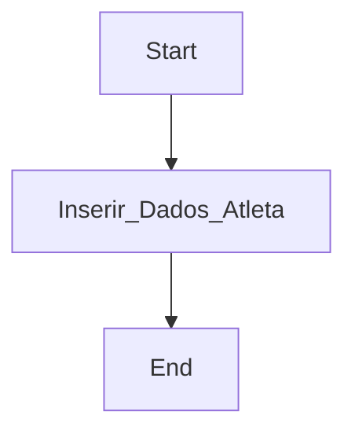
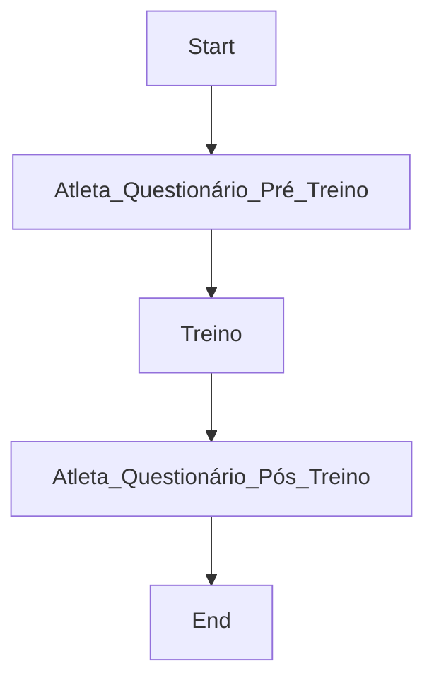
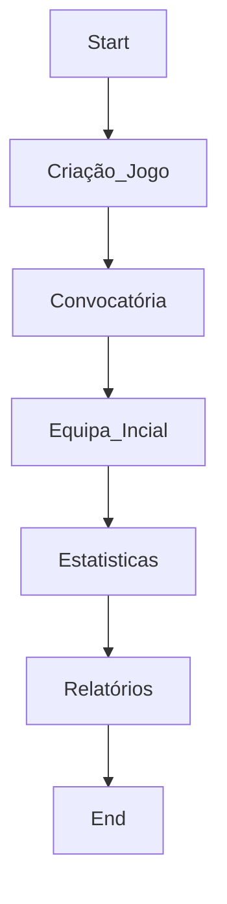

# Projecto R

:::info
:bulb: Este documento descreve as necessidades que vão servir de base para uma solução para fazer o seguimento de vários parâmetros e métricas de jogadores de uma equipa de futebol 11.
:::

## :beginner: Informação da Solução Info

- Product Name: Project R
- Status:
    - [x] Em especificação
    - [ ] Em analise funcional
    - [ ] Em analise tecnica
    - [ ] Em estimativa
    - [ ] Em planeamento
    - [ ] Em desenvolvimento
    - [ ] Em revisão
    - [ ] Em testes funcionais
    - [ ] Terminado

## :triangular_flag_on_post: Necessidade

:::success
Tendo como base uma equipa de futebol, com um plantel de 40 jogadores, é necessário medir fadiga individual, performance individual e dados estatisticos relacionados com futebol, em treino e em jogo. Os dados terão que ser introduzidos quer pelos jogadores, quer por analistas, quer pela equipa técnica. A solução terá que providenciar relatórios e dashboards com o resultado dos dados recolhidos e de cruzamento dos mesmos dados. A solução pode ser composta por uma ou mais aplicações a serem desenvolvidas ou utilização de aplicações já existentes desde que sejam de custo 0. Se houver mais que uma aplicação, a integração dos dados tem que ser assegurada. A solução, no que diz respeito à recolha de dados, pode ser através de dispositivos móveis. Todos os dados tem que ser persistidos.
:::

## 📈 Solução

:::success
A solução terá os seguintes módulos
:::

- Gestão de Plantel
- Calendário e Planeamento
- Registo de Fadiga (pré e pós-sessão)
- Registo de Estatísticas
- Notificações
- Consulta de Relatórios e Dashboards
- Administração (permissões, épocas)
- Análise de Adversários *(opcional)*

## :exclamation: Riscos

:::success
Lista de riscos e possiveis problemas.
:::

1. Adesão dos jogadores ao preenchimento dos questionários de fadiga — mitigação via notificações push
2. Qualidade dos dados introduzidos manualmente — sem validação automática, dados incorretos afetam a fiabilidade dos relatórios
3. Custo zero pode limitar as opções de integração entre aplicações
4. Volume de dados ao longo de múltiplas épocas pode impactar performance da solução
5. Conformidade RGPD para dados de saúde de menores — consentimento parental não recolhido invalida os dados de jogadores com 13–15 anos

## :feet: Implementação

:::success

### Gestão de Plantel

A solução terá que permitir registar todos os jogadores em um plantel. Os jogadores terão que ter os seguintes dados: Nome, idade, numero de jogador, foto. O peso e a altura serão dados que serão recolhidos e que terá que haver um histórico util para os relatórios que serão descritos mais à frente. Teremos que ter igualmente a sua posição em campo principal e até 4 posições alternativas.

Cada jogador terá uma **página de perfil unificado** que consolida todos os seus dados: informação pessoal, histórico de peso/altura, evolução de fadiga, estatísticas por época e carreira, presenças em treinos e jogos, e estado de prontidão atual.

### Gestão de Épocas

O sistema organiza todos os dados por época (ex: 2024/2025, 2025/2026), com data de início e fim configurável. Os dados acumulam de época para época — o histórico de jogadores é preservado ao longo de toda a carreira no clube. Relatórios e dashboards podem ser filtrados por época ou mostrar dados acumulados de múltiplas épocas.

### Calendário de Treinos e Jogos

A equipa técnica regista antecipadamente as sessões de treino e jogos com data, hora e tipo. Este calendário serve de base ao sistema de notificações e como vista de agenda para toda a equipa. O registo de treinos e jogos (com os seus dados detalhados) é feito na respetiva sessão calendarizada.

### Modelo de Acesso e Permissões

- **Jogadores:** acedem apenas aos seus próprios questionários de fadiga. Não têm acesso aos seus dados de performance — esses poderão ser partilhados pela equipa técnica via exportação em PDF.
- **Equipa técnica e analistas:** têm acesso total a todos os dados do sistema.

### Considerações de Escalão Etário

O sistema cobre jogadores a partir dos **13 anos**, incluindo escalões de formação (sub-14, sub-15, sub-17, sub-19) e seniores. Esta faixa etária implica diferenciações funcionais:

- **Limiares de carga:** os valores de referência do ACWR e os indicadores de prontidão aplicam-se de forma diferenciada a jogadores em desenvolvimento (13–17 anos) vs. seniores, dado que atletas jovens têm maior vulnerabilidade a sobrecarga durante fases de crescimento acelerado.
- **Questionários adaptados:** a linguagem das 5 dimensões do questionário de fadiga deve ser validada para o escalão sub-14 — simplificada onde necessário, mantendo o rigor das métricas.
- **Princípio LTAD (Long-Term Athlete Development):** o protocolo de monitorização para jovens deve ser individualizável, simples e sustentável — complexidade excessiva compromete a adesão nesta faixa etária.
- **Perfil de escalão:** cada jogador tem o seu escalão registado no perfil, permitindo que dashboards e relatórios apliquem os limiares adequados automaticamente.

### Conformidade e Proteção de Dados

Os dados recolhidos pelo sistema constituem **dados de categorias especiais** ao abrigo do RGPD (Regulamento Geral de Proteção de Dados), nomeadamente dados de saúde (Art.º 9.º). O sistema deve garantir conformidade com os seguintes requisitos:

- **Consentimento parental obrigatório** para jogadores com 13–15 anos — Portugal fixou a idade de consentimento em 13 anos, mas o consentimento de menores nesta faixa requer autorização do titular da responsabilidade parental. O onboarding deve incluir um fluxo explícito de recolha deste consentimento.
- **Base jurídica para dados de saúde:** o processamento dos dados de fadiga e bem-estar deve ter base jurídica documentada ao abrigo do Art.º 9.º(2) do RGPD (consentimento explícito ou outra exceção aplicável).
- **Retenção limitada:** definir período máximo de retenção por tipo de dado; dados de escalões transitórios não devem ser retidos indefinidamente.
- **Direito ao apagamento:** qualquer jogador (ou responsável parental, para menores) pode solicitar eliminação dos seus dados.
- **Controlo de acesso estrito:** dados de saúde acessíveis apenas a utilizadores autorizados; logs de acesso recomendados.
- **Conformidade com a CNPD** (Comissão Nacional de Proteção de Dados, Portugal): manter registo das atividades de tratamento e política de privacidade clara, incluindo versão adaptada para menores.

### Registo de Fadiga dos Jogadores

Cada jogador, **antes e depois de cada treino e jogo**, terá que responder a um questionário em que deverá indicar o seu nivel de fadiga em 5 dimensões: Energia muscular, Concentração e motivação, qualidade de descanso, desconforto muscular/articular e estado emocional. O questionário é unipessoal.

Os resultados terão de estar disponiveis em tempo real para a equipa técnica e para os analistas.

O sistema calcula automaticamente um **Índice de Carga Acumulada** por jogador, somando minutos jogados, presenças em treino e scores de fadiga numa janela configurável (ex: últimos 7 e 30 dias), gerando um indicador verde/amarelo/vermelho. O cálculo segue a metodologia **Acute:Chronic Workload Ratio (ACWR)** — rácio entre carga aguda (últimos 7 dias) e carga crónica (últimos 28 dias). ACWR entre 0,8–1,3 indica zona segura; acima de 1,5 o risco de lesão não-contacto aumenta 5–7x.

O sistema suporta adicionalmente o registo de **Session-RPE** (escala de esforço percebido × duração da sessão em minutos) como indicador complementar de carga interna, registado pelo analista após cada sessão.

A linguagem do questionário de fadiga deve ser testada e validada para jogadores dos escalões sub-14, garantindo que os conceitos (ex: "desconforto articular", "estado emocional") são compreensíveis para a faixa etária.

### Notificações Push

O sistema envia notificações push automáticas aos jogadores X minutos antes e depois de cada sessão de treino ou jogo, lembrando-os de preencher o questionário de fadiga. O tempo de antecedência é configurável pela equipa técnica.

### Dados Estatísticos Individuais por Jogador

Métricas de registo manual validadas pela investigação científica como as mais preditivas de resultados em futebol 11:

- Perdas de bola
- Recuperação de bola
- Remates (totais e enquadrados)
- Passes completados
- Pressões defensivas
- Acções defensivas com sucesso
- Acções ofensivas com sucesso

### Registo de Treinos

Nas sessões de treinos vai ter presenças dos jogadores com o questionário de fadiga associado (pré e pós-treino), estatisticas especificas para o treino, notas da equipa técnica.

### Registo de Jogos

No registo dos jogos teremos estatisticas associadas ao jogador, jogadores convocados, equipa titular, tempo de utilização, posição dos jogadores.

### Relatórios e Dashboards

A consulta de relatórios é sempre manual — não há envio automático de resumos.

Os seguintes relatórios e dashboards deverão estar disponíveis:

- **Painel de Prontidão do Plantel** — vista consolidada de todos os jogadores com status de prontidão (verde/amarelo/vermelho) calculado a partir de fadiga, carga acumulada e presenças. Suporta decisão de convocatória.
- **Correlação Fadiga × Performance** — cruzamento dos inputs do questionário de fadiga com as estatísticas do mesmo jogador no treino ou jogo seguinte, revelando padrões individuais.
- **Curva de Recuperação Individual** — evolução da fadiga de cada jogador nos dias após uma sessão intensa, gerando um perfil de recuperação.
- **Dashboard de Equipa Agregado** — métricas coletivas do plantel: média de fadiga, taxa de presença em treinos, estatísticas agregadas por época.
- **Perfil individual** — todos os dados de um jogador numa única vista (ver Gestão de Plantel).
- **Exportação em PDF** — a equipa técnica pode gerar e partilhar com jogadores individuais um relatório PDF com os seus dados de performance.

### Análise de Adversários *(opcional)*

Módulo secundário para registo de dados dos adversários — formação habitual, jogadores-chave, padrões táticos observados. Consultável antes da preparação de um jogo. Completamente separado do core da plataforma e de implementação opcional.

### Recolha de estatisticas

A recolha de estatisticas terá que ser feita em um dispositivo tactil e terá ecrãs muito simples para os jogos um ecrã com a equipa em campo com 1 botão com o numero do respectivo jogador, que ao pressionar o botão do jogador abre outro ecrã para selecionar a acção de jogo que irá para o ecrã final onde vamos selecionar a zona do campo em que a acção aconteceu. Segue 3 images com um draft do que se espera destes 3 ecrãs.

Ecrã com os jogadores em jogo

Ecrã com as acções

Ecrã com as zona do campo

:::

### :small_blue_diamond: Fluxo

:::warning
Create a flow chart to show the process.
:::

### :small_blue_diamond: Specs

:::warning
List the specs for this product.
:::

| Item | Specs | Note |
| ---- | ----- | ---- |
| Plataforma | PWA (Progressive Web App) | Mobile-first, funciona como app sem publicação nas stores, suporta push notifications nativas |
| Custo de infraestrutura | Zero | Stack: React/Next.js + Node.js/PostgreSQL via Supabase free tier + FCM para push notifications + Vercel/Railway para hosting |
| Utilizadores simultâneos | Até 40 jogadores + equipa técnica | Adequado para free tiers das plataformas recomendadas |
| Retenção de dados | Múltiplas épocas | Histórico completo por jogador preservado; definir política de arquivo para épocas antigas |
| Faixa etária | 13 anos e acima | Implica consentimento parental para 13–15 anos (RGPD Portugal) |
| Metodologia de carga | ACWR (7/28 dias) | Zona segura: 0,8–1,3; alerta vermelho: >1,5 |

### :small_blue_diamond: Desenho

:::warning
Provide the design for this product. You can embed Figma files with this syntax ``, or just paste the embed code here.
:::

## 💬 Questões

:::success
Discuss other things that are not on the above. For example, any blind spot on our product specs?
:::

1. Qual a plataforma alvo — aplicação móvel nativa, web app responsiva, ou ambas?
2. Como é feita a gestão de jogadores que saem ou entram no plantel a meio da época?
3. Os questionários de fadiga têm sempre as mesmas 5 dimensões ou são configuráveis?
4. Qual o volume esperado de dados históricos — quantas épocas de histórico a preservar?

### :small_blue_diamond: A checklist for stakeholders

| Question | Answer |
| -------- | ------ |
| 1. What is the result you want? | Que a equipa técnica consiga prever picos de performance, perceber onde e quando cada atleta rende mais, e conhecer a disponibilidade de cada um — com dados fiáveis e em tempo útil. |
| 2. Why is this result important? | Para tomar decisões proativas e exatas que maximizem o potencial individual de cada atleta e aumentem as probabilidades de ganhar jogos. |
| 3. How will you evaluate progress? | Adesão dos jogadores aos questionários, utilização dos dashboards pela equipa técnica, visibilidade de padrões de fadiga antes invisíveis, redução de lesões por sobrecarga, e qualidade percebida das decisões de convocatória. |
| 4. How can you influence the result? | Construindo uma ferramenta de custo controlado que estruture a recolha de dados de fadiga e performance — tornando visível o que hoje é invisível e substituindo a sensibilidade por evidência. |
| 5. Who is responsible for the results? | Treinador principal. |
| 6. How do you know you have achieved your goal? | Quando a equipa técnica toma decisões baseadas em dados e não em sensibilidade — e quando os resultados dos jogos refletem uma melhor gestão individual dos atletas. |
| 7. How often will you review? | Semana a semana. |

## 📋 Backlog de Evolução Futura

Funcionalidades identificadas mas não prioritárias para a versão inicial:

- Alertas em tempo real durante jogos (ex: demasiadas perdas de bola por um jogador)
- Benchmarks e métricas diferenciados por posição de campo
- Objetivos e metas individuais por jogador com tracking de progresso
- Integração com wearables (smartwatch, banda de fitness) via **API aberta** — a arquitetura deve prever endpoints para receber dados de GPS e sensores externos sem reescrever o núcleo
- Estatísticas automáticas via **computer vision/análise de vídeo** — importação de dados de jogo a partir de vídeo de smartphone (previsão de viabilidade: 2–4 anos)
- Métricas avançadas de análise tática: **xG (Expected Goals)** e **PPDA (Passes por Ação Defensiva)**
- Distância total percorrida e sprints por jogador (requer integração GPS)
- Resumos automáticos periódicos enviados à equipa técnica
- Limiares de carga ACWR diferenciados por posição de campo (defesa, médio, avançado)
